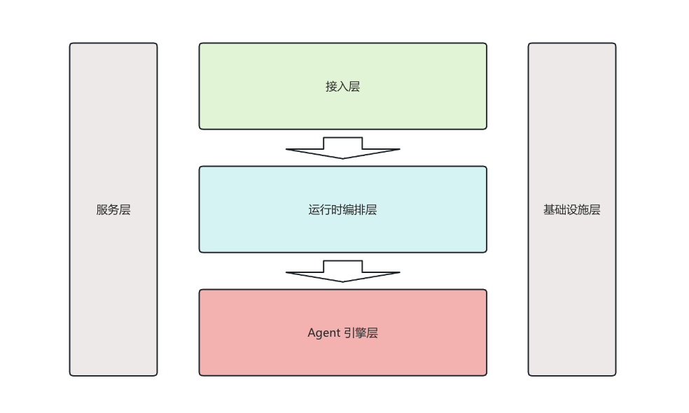

<h1 align="center">Claude Code Harness</h1>

> 灵感来源 [OpenHarness](https://github.com/HKUDS/OpenHarness) 和 [Claude Code](https://claude.ai/)。


Golang 实现的阉割版 [Claude Code](https://claude.ai/)。围绕 LLM 构建完善 Agent 框架。模型提供思考，Harness 实现手、眼睛、记忆和安全边界。

<p align="center">
  
  <br>
  <sub>图片来自 <a href="https://github.com/HKUDS/OpenHarness">OpenHarness</a></sub>
</p>

AI 应用百花齐放，各种概念层出不穷：

> Prompt Engineering → Context Engineering → RAG → AI Agent → OpenClaw → Harness Engineering → Hermes Agent

跟风爆款概念？还是专注底层原理？这是摆在程序员面前的两条路。我认为**都不是**——核心在于：**能不能提高效率？能解决什么业务问题？**

<br>
我选择专注 Claude Code。原因有二：

1. 业界公认的 top 级 AI 编程应用
2. ["开源"](https://github.com/sanbuphy/learn-coding-agent)

## 架构图

<p align="center">
  
</p>

接入层：

- Node 进程渲染终端 UI
- 纯 Go 实现终端 UI
- 无交互模式，直接向 stdout 输出文字或 JSON

<br>
运行时编排层：

- 组装一个会话所需的所有状态，包括：API 客户端、工具注册表、权限检查器、Hook 执行器、MCP 管理器等

<br>
Agent 引擎层：

- 实现 Agent Loop — "LLM 推理 → 工具调用 → 结果反馈" 的核心循环。调用【服务层】和【基础设施层】所提供的能力

<br>
服务层：

- 工具集管理
- 适配多种 LLM API
- 上下文 / 记忆管理管理
- 会话持久化，支持中断和恢复
- 系统提示词组装
- skills管理
- plugins管理
- 多agent协调
- 后台 tasks / cron 任务管理

<br>
基础设施层：

- 多层配置系统
- 权限控制
- 沙箱安全执行环境
- 日志

## 工作原理

```
用户输入 "修复登录bug"
    │
    ▼
HandleLine()
    ├── BuildRuntimeSystemPrompt()
    │     ├── Base Prompt (角色 + 规则)
    │     ├── Environment Info (OS/Git/Python)
    │     ├── Fast Mode / Effort / Passes
    │     ├── Skills Index
    │     ├── CLAUDE.md (项目规则)
    │     ├── Issue / PR Context
    │     └── Memory (通用 + 与"修复登录bug"相关的记忆)
    │
    ├── Engine.SetSystemPrompt(systemPrompt)
    └── Engine.SubmitMessage("修复登录bug")
          │
          ▼
        QueryEngine.SubmitMessage()
          ├── 追加 user message 到历史
          └── RunQuery(context, messages)
                │
                ▼
              Agent Loop (turn 1)
                ├── AutoCompactIfNeeded() → 检查是否需要压缩
                ├── ApiClient.StreamMessage() → 调用 LLM
                │     请求: systemPrompt + messages + tools
                │     返回: "我需要先读取登录相关文件" + ToolCall[ReadFile("auth.go")]
                ├── 追加 assistant 消息
                ├── ExecuteToolCall("readFile", ...)
                │     ├── PreHook 检查
                │     ├── 权限检查 (readOnly → 自动放行)
                │     ├── 执行 ReadFile
                │     └── PostHook 通知
                ├── 追加 toolResult 到 messages
                └── 继续循环 →
              Agent Loop (turn 2)
                ├── AutoCompactIfNeeded()
                ├── ApiClient.StreamMessage() → LLM 看到文件内容
                │     返回: "找到了bug，在第42行..." + ToolCall[EditFile(...)]
                ├── ExecuteToolCall("EditFile", ...)
                │     ├── 权限检查 (write → 需要用户确认)
                │     └── 用户确认后执行
                └── 继续循环 →
              Agent Loop (turn 3)
                ├── ApiClient.StreamMessage()
                │     返回: "已修复登录bug，问题出在..."（无 ToolCall）
                └── 无 ToolCall → 循环结束，返回结果
```

## 核心Feature

ReAct（循环引擎）:

- [x] 循环调用 Tool，流式传输
- [x] 指数避让机制进行 API 重试
- [x] 并发调用 Tools
- [ ] token统计和成本追踪

<br>
Toolkit（工具集）:

- [ ] Tools 工具集 (File, Shell, Search, Web, MCP)
- [ ] 按需加载Skill（.md）
- [ ] Plugin插件生态（Skills + Hooks + Agents）
- [ ] 兼容 anthropics/skills & plugins

<br>
Context & Memory（上下文管理）：

- [ ] CLAUDE.md 发现与注入
- [ ] 2 级上下文压缩
- [ ] MEMORY.md 持久化记忆
- [ ] 会话恢复与历史记录

<br>
Governance（治理）：

- [ ] 多级权限模式
- [ ] 路径级 & 命
- [ ] PreToolUse / PostToolUse 钩子
- [ ] 人机协同审批机制

<br>
Swarm Coordination（调度）：

- [ ] 子Agent生成与任务委派
- [ ] 团队注册与任务管理
- [ ] 后台任务生命周期管理
- [ ] [ClawTeam](https://github.com/HKUDS/ClawTeam) 集成

## 快速开始

// todo

## Q & A

多agent协调？

<br>
调用 Tool 一直报错怎么办？
- 情况1：执行工具前报错，如权限审批不通过；则直接返回给用户
- 情况2：执行工具报错，则把错误信息回灌给LLM，由LLM决定下一步调用

<br>
如何实现 Memory 管理？
- 1、存储: 每个项目的记忆是一组 Markdown 文件 + MEMORY.md 索引，存储在 ~/.openharness/data/memory/{project-hash}/
- 2、管理: 通过 /memory add|remove|list|show 命令或 LLM 直接写文件进行 CRUD
- 3、召回: 每次用户输入时，用关键词匹配（标题权重 2x，正文 1x）找到最相关的记忆文件
- 4、注入: 将 MEMORY.md 索引 + 相关记忆全文注入 system prompt，让 LLM 在推理时能"回忆"起项目上下文
- 5、无向量化: 采用简单的 token 匹配而非嵌入向量，轻量无依赖

<br>
如何实现回话中断和恢复？
- 重启加载快照，恢复messages列表
- UI / 通道层面的「打断」